# Verdict

[](https://verdict-web.onrender.com)
[](https://verdict-api-x75u.onrender.com/health)
[](https://github.com/veera-1175/verdict)
[](LICENSE)

**Multi-agent AI code review for GitHub Pull Requests** — six specialist agents, static analysis (ESLint + Semgrep), deterministic confidence scoring, and role-based dashboards.

Solo-built end-to-end by **[Veerasegaran V P](https://github.com/veera-1175)** — an independent multi-agent PR review product with LLM orchestration, GitHub App webhooks, and AtlasIQ-style multi-tenant RBAC.

<p align="center">
  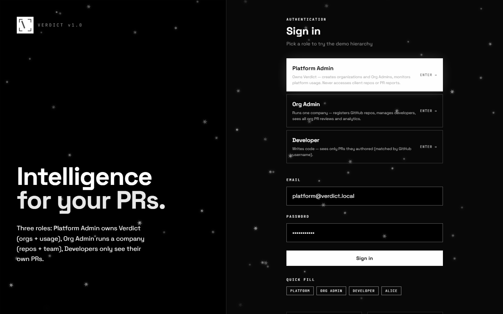
</p>

---

## Table of contents

- [Live demo](#live-demo)
- [What is Verdict?](#what-is-verdict)
- [Screenshots](#screenshots)
- [Key features](#key-features)
- [How a review runs](#how-a-review-runs)
- [Roles & permissions](#roles--permissions)
- [Architecture](#architecture)
- [Tech stack](#tech-stack)
- [Quick start (local)](#quick-start-local)
- [Demo accounts](#demo-accounts)
- [Suggested interview walkthrough](#suggested-interview-walkthrough)
- [Project structure](#project-structure)
- [API overview](#api-overview)
- [Testing](#testing)
- [Deployment](#deployment)
- [Environment variables](#environment-variables)
- [Project status](#project-status)
- [Author](#author)

---

## Live demo

| | |
|---|---|
| **Dashboard** | [https://verdict-web.onrender.com](https://verdict-web.onrender.com) |
| **API health** | [https://verdict-api-x75u.onrender.com/health](https://verdict-api-x75u.onrender.com/health) |
| **Best login for demos** | `admin@verdict.local` / `admin123` (Org Admin) |
| **Stack** | Render free tier (static web + Node API) |

> **Note:** Free-tier API sleeps after ~15 minutes idle. The first visit may take 30–60 seconds to wake. Local JSON DB on Render resets when the free instance recycles — fine for demos; use Supabase for durable prod data.

---

## What is Verdict?

Code review does not scale when every PR waits on a senior engineer, and generic chatbots dump noise without evidence or ownership.

**Verdict solves that:**

1. **Review every PR automatically** — GitHub App webhook on open/update → multi-agent review → comment + Check Run.
2. **Separate platform from tenant data** — Platform Admin never sees client PR contents; Org Admins own repos and reports.
3. **Show developers only their work** — PR visibility matched by GitHub username.

This is a **working MVP / demo application**, designed to be cloned, run locally or on Render, and walked through in technical interviews.

---

## Screenshots

### Login — three demo roles

<p align="center">
  
</p>

### Platform Admin — Command Center

Onboard organizations and monitor usage without accessing client PR reports.

<p align="center">
  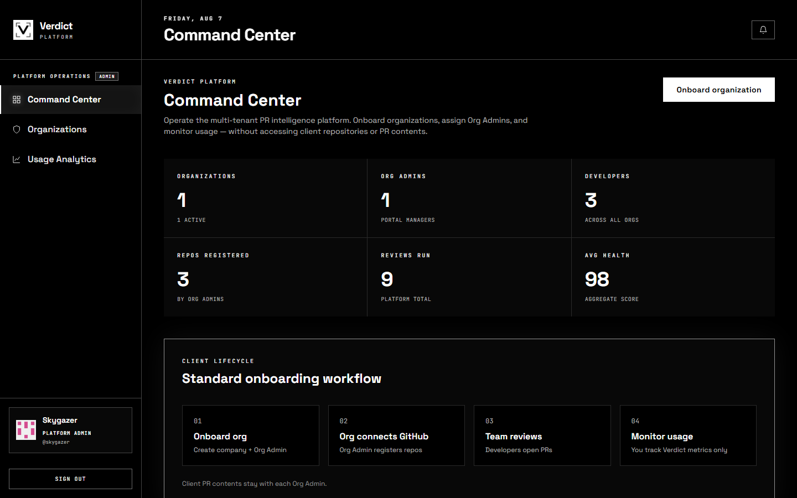
</p>

### Organizations

<p align="center">
  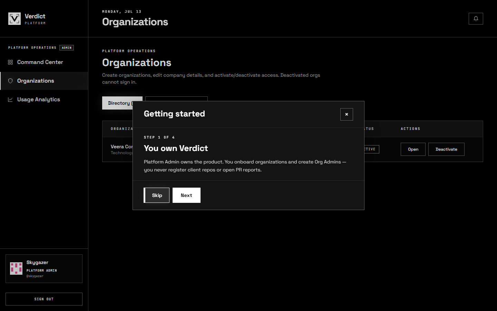
</p>

### Org Admin — Dashboard

Repos, recent PR activity, and health scores for one company.

<p align="center">
  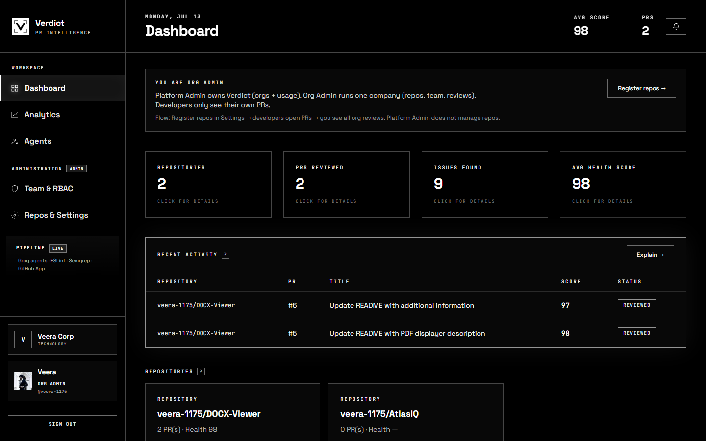
</p>

### Agents pipeline

<p align="center">
  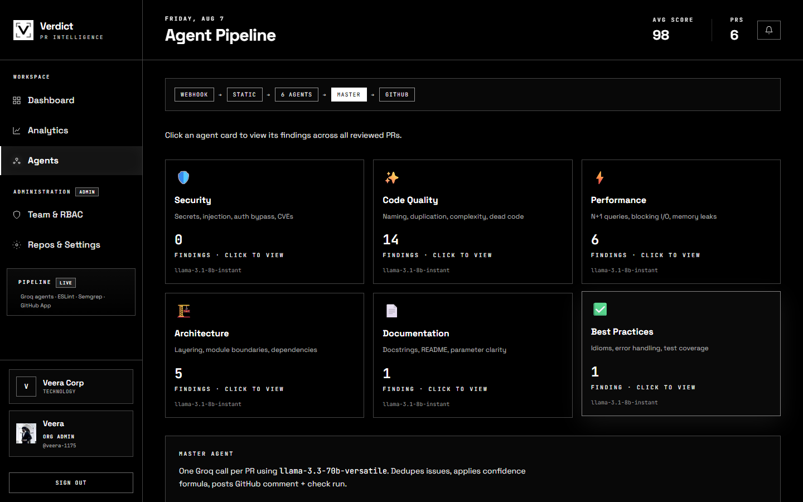
</p>

### Analytics

<p align="center">
  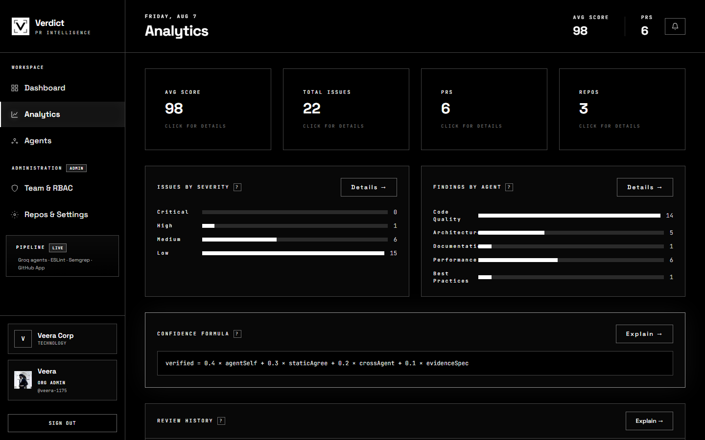
</p>

### Team & RBAC

<p align="center">
  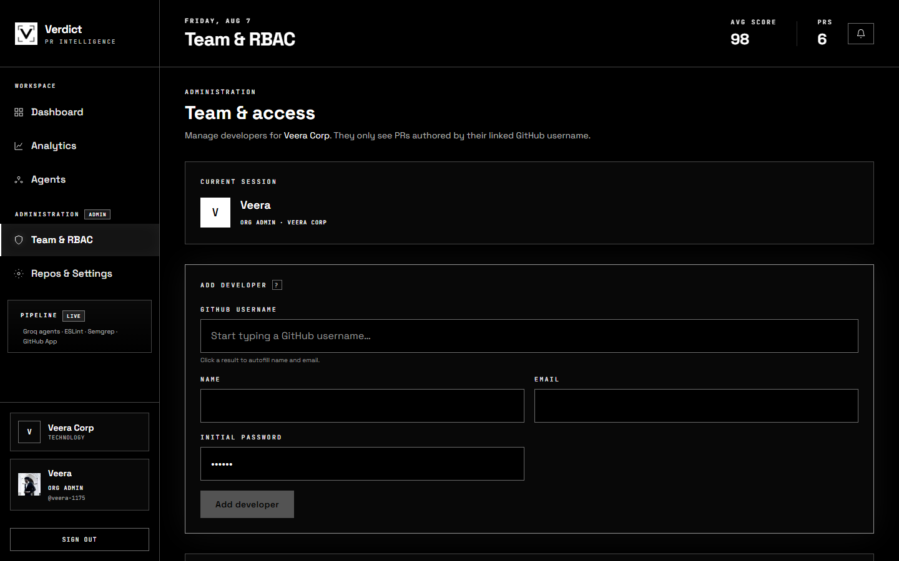
</p>

### Repos & Settings

<p align="center">
  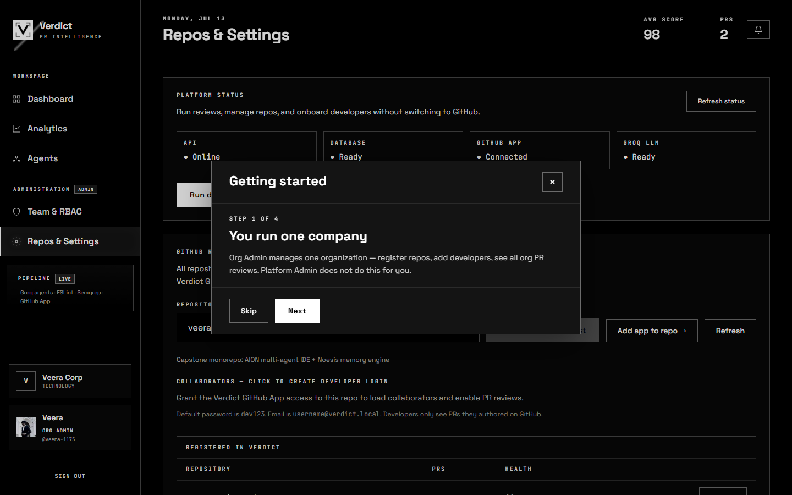
</p>

### PR report — health score, evidence, How to fix

<p align="center">
  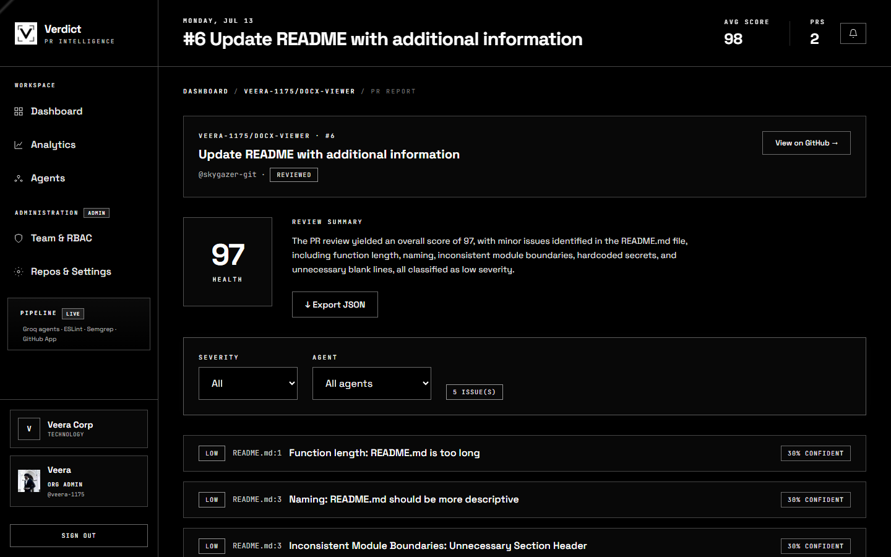
</p>

---

## Key features

| Area | What Verdict does |
|------|-------------------|
| **Multi-agent review** | Security, Code Quality, Performance, Architecture, Docs, Best Practices in parallel on Groq |
| **Master merge** | Dedupes findings, scores health, writes summary |
| **Confidence** | Deterministic **40 / 30 / 20 / 10** formula (agent + static + agreement + evidence) |
| **Static analysis** | ESLint + Semgrep feed agreement signals |
| **GitHub native** | PR webhook, bot comment with **How to fix**, Check Run pass/fail |
| **RBAC** | Platform Admin · Org Admin · Developer — separate nav shells |
| **Org isolation** | Platform never reads tenant PR contents |
| **Developer scope** | Only PRs authored by linked GitHub username |
| **Ops** | `render.yaml` blueprint, local `start:all` + ngrok, Vitest |

---

## How a review runs

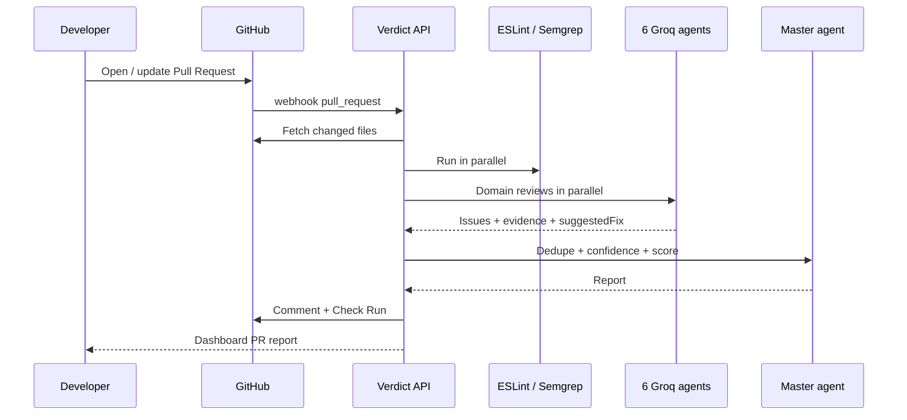

**Design choices worth discussing in interviews:**

- **Webhook-first** — no polling; collaborators get reviews without clicking Trigger.
- **Evidence required** — agents must quote diff/content; empty evidence is hidden in the UI.
- **Highlighted fixes** — report UI emphasizes **How to fix** as the actionable section.
- **Free LLM path** — Groq free tier; no paid Anthropic required for the demo.

---

## Roles & permissions

| Role | Who | Can do | Cannot do |
|------|-----|--------|-----------|
| **Platform Admin** | Skygazer / Verdict operator | Orgs, Org Admins, platform usage | Repos, PR reports, org analytics |
| **Org Admin** | e.g. Veera @ Veera Corp | Register repos, team, all org PRs, settings | Other orgs / platform ops |
| **Developer** | Collaborators | Own PR reports only | Org details, team, settings |

Creating a GitHub repo ≠ admin. Deactivated orgs cannot log in.

---

## Architecture

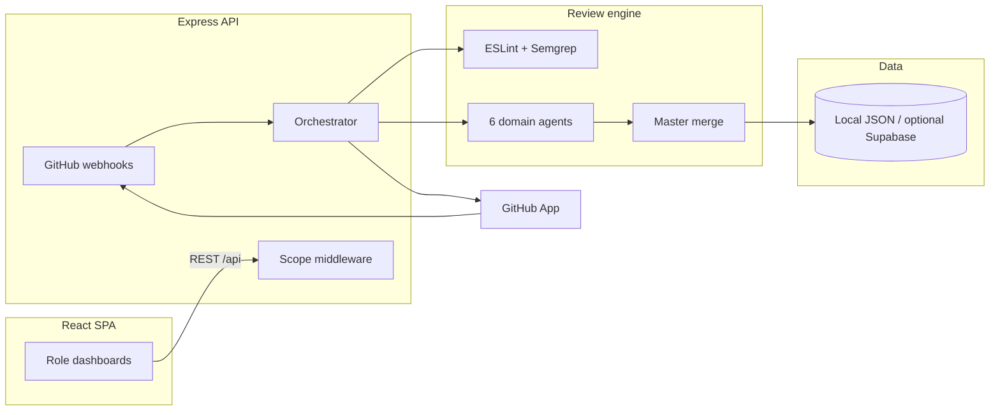

| Layer | Responsibility |
|-------|----------------|
| **Web** | Vite + React, role nav, PR report UI |
| **API** | Auth, webhooks, org/platform routes, orchestrator |
| **Agents** | Shared `runDomainAgent` + master merge |
| **Store** | `.verdict/data.json` locally / on Render free; Supabase optional |

---

## Tech stack

| | Technologies |
|---|-------------|
| **Backend** | Node 20+, Express, TypeScript |
| **Frontend** | React 19, Vite, Tailwind CSS |
| **AI** | Groq (`llama-3.1-8b-instant` agents, `llama-3.3-70b` master) |
| **GitHub** | GitHub App (Octokit), webhooks, Checks, Issues |
| **Static** | ESLint, Semgrep (optional CLI) |
| **Deploy** | Render (`render.yaml`), local ngrok via `npm run start:all` |

---

## Quick start (local)

**Prerequisites:** Node.js 20+, free [Groq API key](https://console.groq.com), optional [ngrok](https://ngrok.com) + GitHub App for live webhooks.

```powershell
git clone https://github.com/veera-1175/verdict.git
cd verdict
npm run setup       # install + copy env templates + demo review
npm run start:all   # API :3001 + web :5173 + ngrok (static domain)
```

| Service | URL |
|---------|-----|
| **UI** | http://localhost:5173 |
| **API health** | http://localhost:3001/health |

Full GitHub App steps: **[SETUP.txt](SETUP.txt)**.

---

## Demo accounts

| Role | Email | Password | Use for |
|------|-------|----------|---------|
| Platform Admin | `platform@verdict.local` | `platform123` | Orgs + usage only |
| **Org Admin** | `admin@verdict.local` | `admin123` | **Best default for interviews** |
| Developer | `developer@verdict.local` | `dev123` | Own-PR scope |

Login includes one-click role cards and quick-fill chips.

---

## Suggested interview walkthrough (~10 minutes)

1. **Open live demo** → Org Admin (`admin@verdict.local`).
2. **Dashboard** → show repos, health scores, recent PRs.
3. **Open a PR report** → Health KPI, evidence, highlighted **How to fix**.
4. **Agents / Analytics** → six specialists + severity breakdown.
5. **Team** → GitHub user search + developer scope story.
6. **Switch to Platform Admin** → Command Center; emphasize no PR contents.
7. **GitHub** → show bot comment / Check on a real PR if time allows.
8. **Architecture** → webhook → static → agents → master → comment.

---

## Project structure

```
verdict/
├── apps/api/src/
│   ├── agents/           # Domain agents (index) + master + LLM client
│   ├── routes/           # auth, platform, org, repos, reviews, webhook…
│   ├── github/           # App client, diff fetch, comments, verify
│   ├── static-analysis/  # ESLint + Semgrep
│   ├── db/               # localStore + optional Supabase
│   └── orchestrator.ts   # Review pipeline
├── apps/web/src/
│   ├── pages/            # Role dashboards, PR report, settings, team
│   ├── components/       # Layout, modals, tour
│   └── lib/              # auth, roles, api client
├── docs/screenshots/     # README screenshots (from live demo)
├── scripts/
│   ├── setup.ps1
│   ├── start-all.ps1     # API + web + ngrok static domain
│   └── capture-screenshots.mjs
├── render.yaml           # Render Blueprint (API + static web)
├── SETUP.txt             # One-time GitHub App checklist
└── package.json          # npm workspaces
```

---

## API overview

| Area | Examples |
|------|----------|
| Health | `GET /health` |
| Auth | `POST /api/auth/login` |
| Platform | `/api/platform/*` (orgs, usage, password requests) |
| Org | `/api/org/*`, `/api/admin/*`, `/api/repos`, `/api/prs` |
| Stats | `GET /api/stats`, `GET /api/stats/findings` |
| Webhooks | `POST /webhooks/github` |

---

## Testing

```powershell
npm run test -w @verdict/api
npm run build -w @verdict/api
npm run build -w @verdict/web
```

---

## Deployment

### Render (current live stack)

1. Repo: [github.com/veera-1175/verdict](https://github.com/veera-1175/verdict)
2. Render → **Blueprint** → connect repo (`render.yaml`)
3. Set secrets: `GROQ_API_KEY`, `GITHUB_APP_ID`, `GITHUB_APP_PRIVATE_KEY`, `GITHUB_WEBHOOK_SECRET`
4. GitHub App webhook → `https://<your-api>.onrender.com/webhooks/github`

Live:

- Web: https://verdict-web.onrender.com  
- API: https://verdict-api-x75u.onrender.com  

### Local webhooks

`npm run start:all` tunnels with the free ngrok static domain so the GitHub webhook URL stays stable.

---

## Environment variables

Templates: `apps/api/.env.template`, `apps/web/.env.template`

| Variable | Where | Description |
|----------|--------|-------------|
| `GROQ_API_KEY` | API | LLM reviews |
| `GITHUB_APP_ID` / `GITHUB_APP_PRIVATE_KEY` | API | GitHub App auth |
| `GITHUB_WEBHOOK_SECRET` | API | HMAC verify |
| `VERDICT_LOCAL_DB` | API | `true` = JSON store (demo) |
| `WEB_ORIGIN` / `PUBLIC_DASHBOARD_URL` | API | CORS + comment links |
| `VITE_API_URL` | Web | API base (build-time) |
| `VITE_GITHUB_APP_SLUG` | Web | Install link |

---

## Project status

| Area | Status |
|------|--------|
| 3-role RBAC + scoped PR visibility | Done |
| Multi-agent review + confidence + GitHub comment/check | Done |
| Org Admin settings, team, analytics, agents UI | Done |
| Platform Command Center + organizations | Done |
| Local demo (`setup` / `start:all`) | Done |
| Render production deploy + live webhook path | Done |
| Codebase cleanup (dead code, collapsed agents, thinner docs) | Done |
| Durable multi-tenant DB (Supabase) on free Render | Optional / not required for demo |
| Custom domain / paid always-on instances | Optional |

**Verdict is complete as a product MVP** for portfolio, viva, and interview demos: end-to-end PR review, RBAC, and a live Render deploy. Remaining items above are production hardening only — not missing core features.

To run locally: `npm run setup` → `npm run start:all` → http://localhost:5173  
To walk the live demo: [verdict-web.onrender.com](https://verdict-web.onrender.com) as `admin@verdict.local` / `admin123`.

---

## Author

**Veerasegaran V P**

- GitHub: [@veera-1175](https://github.com/veera-1175)
- Repository: [github.com/veera-1175/verdict](https://github.com/veera-1175/verdict)
- Live demo: [verdict-web.onrender.com](https://verdict-web.onrender.com)

If you are reviewing this for hiring, I can walk through the webhook → agents → confidence → RBAC path live in about 10 minutes.

---

<p align="center">
  <sub>MIT License · Built with Express, React, Groq, and GitHub Apps · Portfolio project 2026</sub>
</p>
